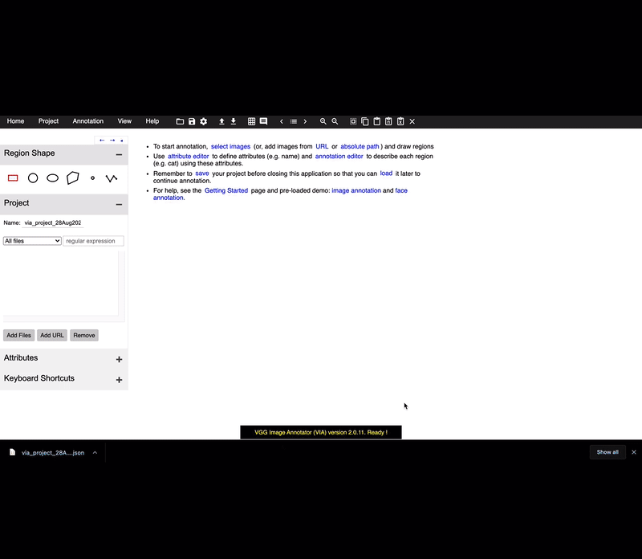

# Image Annotations Readme.
 

Image Annotations is the most complicated tasks for a data-scientist, your whole ml/dl pipelines depends on your data and you have to carefully annotate all the images so that your model will be accurate enough to deploy for real-life use. So, their are some visual gifs which will help you out in learning making your own annotations.

   

### 1. Sort Images:
First of we have to sort images, remove all the unwanted images best option to remove unwanted images is to remove all the images which you are not able to classify or see a certain object which you want to annotate. 

   

### 2. Load Images
Load images into [via_image_annotator](image_annotator.html). Go to the load option on the left side of the page and load images, you just sorted

   

### 3. Setup Labels

Setup your labels (objects you want to annotate), In the left vertical tab you can see attributes tab, press the tab and fill up the region attributes form.  I hard-coded the region attribute as (class) so name it class only, select the type (checkbox , dropdown, text, radio)etc depends on your problem. I prefer to use checkbox, than you have to add object names which you want to annotate, first object will always be empty class, (Read mrcnn-aglo to understand this)

   

### 4. Annotate Images

Now you have to annotate images, you can use, rectangle, polygon, polyline, circle etc according to your problem. In this git we made all the things according to the polygons. Will add rectangle later.

   

### 5. Save your annotations

After all of the annotation you have to save annotation file. Save your project, Go to the project dropdown at the top-bar and in the last you can see save button press the button and click ok your project will be saved. You can also export your annotations in csv, json, yml etc.

# Author 

* Sohaib Anwaar
* gmail          : sohaibanwaar36@gmail.com
* linkedin       : [Have Some Professional Talk here](https://www.linkedin.com/in/sohaib-anwaar-4b7ba1187/)
* Stack Overflow : [Get my help Here](https://stackoverflow.com/users/7959545/sohaib-anwaar)
* Kaggle         : [View my master-pieces here](https://www.kaggle.com/sohaibanwaar1203)